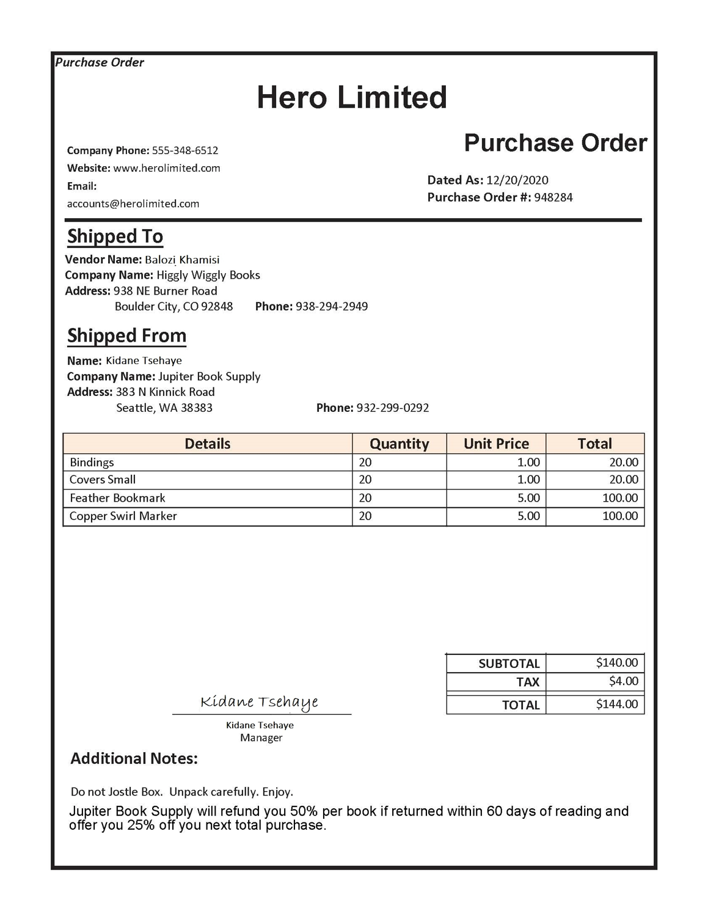

---
lab:
    title: 'フォームからデータを抽出する'
    module: 'モジュール 6 - ドキュメントインテリジェンス'
---

# フォームからデータを抽出する

ある会社が現在、従業員に手動で注文書を作成し、データベースにデータを入力するよう求めているとします。彼らは、データ入力プロセスを改善するために AI サービスを利用したいと考えています。そこで、フォームを読み取り、データベースを自動的に更新するための構造化データを生成する機械学習モデルを構築することにしました。

**Azure AI Document Intelligence** は、ユーザーが自動データ処理ソフトウェアを構築できる Azure AI サービスです。このソフトウェアは、光学文字認識 (OCR) を使用してフォームドキュメントからテキスト、キー/値ペア、およびテーブルを抽出できます。Azure AI Document Intelligence には、請求書、領収書、名刺を認識するための事前構築済みモデルがあります。このサービスは、カスタムモデルをトレーニングする機能も提供します。この演習では、カスタムモデルの構築に焦点を当てます。

## Visual Studio Code でアプリを開発する準備をする

次に、サービス SDK を使用して Visual Studio Code を使用してアプリを開発します。アプリのコードファイルは GitHub リポジトリに提供されています。

> **ヒント**: すでに **mslearn-ai-document-intelligence** リポジトリをクローンしている場合は、Visual Studio Code で開きます。そうでない場合は、次の手順に従って開発環境にクローンします。

1. Visual Studio Code を起動します。
1. パレット (SHIFT+CTRL+P) を開き、**Git: Clone** コマンドを実行して `https://github.com/MicrosoftLearning/mslearn-ai-document-intelligence` リポジトリをローカルフォルダーにクローンします (フォルダーはどこでも構いません)。
1. リポジトリがクローンされたら、Visual Studio Code でフォルダーを開きます。

    > **注**: Visual Studio Code がコードを信頼するように求めるポップアップメッセージを表示した場合は、ポップアップで **Yes, I trust the authors** オプションをクリックします。

1. リポジトリ内の C# コードプロジェクトをサポートするために追加のファイルがインストールされるのを待ちます。

    > **注**: ビルドおよびデバッグに必要なアセットを追加するように求められた場合は、**Not Now** を選択します。*Detected an Azure Function Project in folder* メッセージが表示された場合は、そのメッセージを安全に閉じることができます。

## Azure AI Document Intelligence リソースを作成する

Azure AI Document Intelligence サービスを使用するには、Azure サブスクリプションに Azure AI Document Intelligence または Azure AI Services リソースが必要です。Azure ポータルを使用してリソースを作成します。

1. ブラウザタブで Azure ポータル `https://portal.azure.com` を開き、Azure サブスクリプションに関連付けられた Microsoft アカウントでサインインします。
1. Azure ポータルのホームページで、上部の検索ボックスに **Document Intelligence** と入力し、**Enter** キーを押します。
1. **Document Intelligence** ページで、**Create** を選択します。
1. **Create Document Intelligence** ページで、次の設定を使用してリソースを構成します：
    - **サブスクリプション**: あなたの Azure サブスクリプション。
    - **リソースグループ**: *DocIntelligenceResources* などの一意の名前でリソースグループを選択または作成します。
    - **リージョン**: 近くのリージョンを選択します。
    - **名前**: グローバルに一意の名前を入力します。
    - **価格レベル**: **Free F0** を選択します (Free レベルが利用できない場合は、**Standard S0** を選択します)。
1. 次に **Review + create** を選択し、**Create** を選択します。Azure が Azure AI Document Intelligence リソースを作成するのを待ちます。
1. デプロイが完了したら、**Go to resource** を選択してリソースの **概要** ページを表示します。

## トレーニング用のドキュメントを収集する

次のようなサンプルフォームを使用してモデルをトレーニングおよびテストします：

。

1. **Visual Studio Code** に戻ります。*Explorer* ペインで **Labfiles/02-custom-document-intelligence** フォルダーを開き、**sample-forms** フォルダーを展開します。フォルダー内に **.json** および **.jpg** で終わるファイルがあることに注意してください。

    **.jpg** ファイルを使用してモデルをトレーニングします。

    **.json** ファイルは事前に生成されており、ラベル情報が含まれています。これらのファイルは、フォームと一緒に BLOB ストレージコンテナーにアップロードされます。

    *sample-forms* フォルダー内の画像は、Visual Studio Code で選択することで表示できます。

1. **Azure ポータル** に戻り、リソースの **概要** ページに移動します。*Essentials* セクションで、Document Intelligence リソースを作成した **リソースグループ** を確認します。

1. リソースグループの **概要** ページで、**サブスクリプション ID** と **場所** を確認します。これらの値は、後の手順で必要になります。

    。

1. Visual Studio Code で、*Explorer* ペインで **Labfiles/02-custom-document-intelligence** フォルダーを開き、言語の好みに応じて **CSharp** または **Python** フォルダーを展開します。各フォルダーには、Azure OpenAI 機能を統合するアプリの言語固有のファイルが含まれています。

1. コードファイルが含まれている **CSharp** または **Python** フォルダーを右クリックし、**統合ターミナルで開く** を選択します。

1. ターミナルで次のコマンドを実行して Azure にログインします。**az login** コマンドは Microsoft Edge ブラウザーを開き、Azure AI Document Intelligence リソースを作成するために使用したのと同じアカウントでログインします。ログインが完了したら、ブラウザーウィンドウを閉じます。

    ```powershell
    az login
    ```

1. Visual Studio Code に戻ります。ターミナルペインで次のコマンドを実行して Azure の場所を一覧表示します。

    ```powershell
    az account list-locations -o table
    ```

1. 出力で、リソースグループの場所に対応する **Name** 値を見つけます (例: *East US* の場合、対応する名前は *eastus* です)。

    > **重要**: **Name** 値を記録し、ステップ 11 で使用します。

1. Visual Studio Code で **Labfiles/02-custom-document-intelligence** フォルダーを開き、**setup.cmd** を選択します。このスクリプトを使用して、必要な他の Azure リソースを作成するために必要な Azure コマンドラインインターフェイス (CLI) コマンドを実行します。

1. **setup.cmd** スクリプトでコマンドを確認します。このプログラムは次のことを行います：
    - Azure リソースグループにストレージアカウントを作成します。
    - ローカルの *sampleforms* フォルダーからストレージアカウント内の *sampleforms* コンテナーにファイルをアップロードします。
    - 共有アクセス署名 (SAS) URI を出力します。

1. Document Intelligence リソースをデプロイしたサブスクリプション、リソースグループ、および場所の名前に適切な値で **subscription_id**、**resource_group**、および **location** 変数宣言を変更します。変更を保存します。

    演習のために **expiry_date** 変数はそのままにしておきます。この変数は、共有アクセス署名 (SAS) URI を生成する際に使用されます。実際には、SAS の有効期限を適切に設定する必要があります。SAS の詳細については [こちら](https://docs.microsoft.com/azure/storage/common/storage-sas-overview#how-a-shared-access-signature-works) を参照してください。

    > **注意**: ステップ 8で 記録した **Name** は location 変数にセットします。
    
1. コードファイルが含まれている **CSharp** または **Python** フォルダーのターミナルで、次のコマンドを入力してスクリプトを実行します：

    ```PowerShell
    $currentdir=(Get-Item .).FullName
    cd ..
    ./setup.cmd
    cd $currentdir
    ```

1. スクリプトが完了したら、表示された出力を確認します。

1. Azure ポータルでリソースグループを更新し、作成された Azure Storage アカウントが含まれていることを確認します。ストレージアカウントを開き、左側のペインで **Storage browser** を選択します。次に、Storage Browser で **Blob containers** を展開し、**sampleforms** コンテナーを選択して、ローカルの **02-custom-document-intelligence/sample-forms** フォルダーからファイルがアップロードされたことを確認します。

## Document Intelligence Studio を使用してモデルをトレーニングする

次に、ストレージアカウントにアップロードされたファイルを使用してモデルをトレーニングします。

1. ブラウザで Document Intelligence Studio に移動します：`https://documentintelligence.ai.azure.com/studio`
1. **Custom models** セクションまでスクロールし、**Custom extraction model** タイルを選択します。
1. アカウントへのサインインを求められた場合は、Azure の資格情報を使用してサインインします。
1. 使用する Azure AI Document Intelligence リソースを尋ねられた場合は、Azure AI Document Intelligence リソースを作成したサブスクリプションとリソース名を選択します。
1. **My Projects** の下で **Create a project** を選択します。次の設定を使用します：

    - **Project name**: 一意の名前を入力します。
        - *Continue* を選択します。
    - **Configure service resource**: 以前にこのラボで作成したサブスクリプション、リソースグループ、および Document Intelligence リソースを選択します。*Set as default* ボックスにチェックを入れます。デフォルトの API バージョンを保持します。
        - *Continue* を選択します。
    - **Connect training data source**: セットアップスクリプトによって作成されたサブスクリプション、リソースグループ、およびストレージアカウントを選択します。*Set as default* ボックスにチェックを入れます。`sampleforms` BLOB コンテナーを選択し、フォルダーパスは空白のままにします。
        - *Continue* を選択します。
    - *Create project* を選択します。

1. プロジェクトが作成されたら、画面の右上で **Train** を選択してモデルをトレーニングします。次の設定を使用します：
    - **Model ID**: *グローバルに一意の名前を提供します (次のステップでモデル ID 名が必要になります)*。
    - **Build Mode**: Template。
1. **Go to Models** を選択します。
1. トレーニングには時間がかかる場合があります。完了すると通知が表示されます。

## カスタム Document Intelligence モデルをテストする

1. Visual Studio Code に戻ります。ターミナルで次のコマンドを実行して Document Intelligence パッケージをインストールします。言語の好みに応じて適切なコマンドを実行します：

    **C#**:

    ```powershell
    dotnet add package Azure.AI.FormRecognizer --version 4.1.0
    ```

    **Python**:

    ```powershell
    pip install azure-ai-formrecognizer==3.3.3
    ```

1. Visual Studio Code で **Labfiles/02-custom-document-intelligence** フォルダーを開き、使用している言語を選択します。構成ファイル (**appsettings.json** または **.env**、言語の好みに応じて) を次の値で編集します：
    - Document Intelligence エンドポイント。
    - Document Intelligence キー。
    - モデルをトレーニングする際に提供したモデル ID。これは Document Intelligence Studio の **Models** ページで確認できます。変更を保存します。

1. Visual Studio Code でクライアントアプリケーションのコードファイル (*Program.cs* for C#, *test-model.py* for Python) を開き、特に URL 内の画像が Web 上のこの GitHub リポジトリ内のファイルを参照していることを確認します。

1. ターミナルに戻り、次のコマンドを入力してプログラムを実行します：

    **C#**

    ```powershell
    dotnet build
    dotnet run
    ```

    **Python**

    ```powershell
    python test-model.py
    ```

1. 出力を確認し、モデルの出力が `Merchant` や `CompanyPhoneNumber` などのフィールド名を提供していることを確認します。

## クリーンアップ

Azure リソースの使用が終了したら、追加の料金が発生しないように [Azure ポータル](https://portal.azure.com/?azure-portal=true) でリソースを削除することを忘れないでください。

## 詳細情報

Document Intelligence サービスの詳細については、[Document Intelligence ドキュメント](https://learn.microsoft.com/azure/ai-services/document-intelligence/?azure-portal=true) を参照してください。
